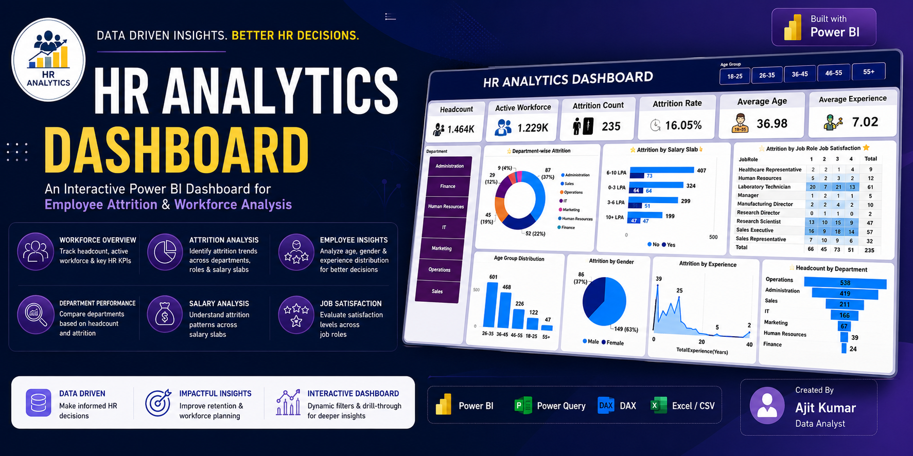
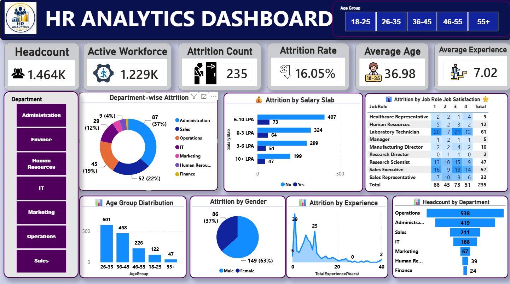
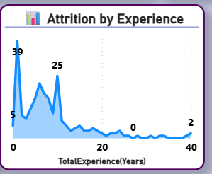
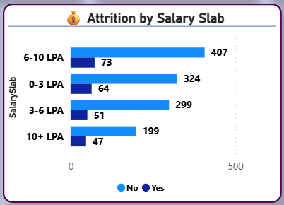

# 👨‍💼 HR Analytics Dashboard | Power BI

<p align="center">
  
</p>

<p align="center">
  
  
  
  
  
</p>

---

# 📌 Project Overview

The **HR Analytics Dashboard** is an interactive **Power BI** solution designed to analyze workforce trends, employee attrition, salary distribution, job satisfaction, and departmental performance.

The dashboard enables HR professionals to make **data-driven decisions** by monitoring key HR metrics through dynamic visualizations and interactive filters.

---

# 🎯 Objectives

- Analyze employee attrition
- Measure workforce KPIs
- Compare department performance
- Analyze salary distribution
- Study age and gender demographics
- Evaluate employee experience
- Support HR decision-making

---

# 📊 Dashboard Preview

<p align="center">

</p>

---

# ✨ Dashboard Features

- 👥 Headcount Analysis
- 📉 Attrition Count & Attrition Rate
- 💼 Active Workforce
- 🎂 Average Age
- 📈 Average Experience
- 🏢 Department-wise Attrition
- 💰 Salary Slab Analysis
- 😊 Job Satisfaction Analysis
- 👨‍💼 Gender Distribution
- 📊 Age Group Distribution
- 📈 Experience Analysis
- 🏢 Department Headcount

---

# 📂 Project Structure

```text
HR-Analytics-Dashboard-PowerBI/
│
├── README.md
├── LICENSE
├── .gitignore
│
├── PowerBI/
│   └── Hr dashboard.pbix
│
├── Dataset/
│   └── HR_Analytics-4.csv
│
├── Documentation/
│   └── Project_Report.pdf
│
├── DAX/
│   └── Measures.md
│
└── Images/
    ├── project_banner.png
    ├── dashboard.png
    ├── attrition_chart.png
    ├── salary_analysis.png
    └── kpi_cards.png
```

---

# 📁 Dataset Information

| Property | Value |
|----------|--------|
| Dataset | HR_Analytics-4.csv |
| Records | 1,480 |
| Features | 37 |
| File Format | CSV |
| Domain | Human Resources Analytics |

---

# 📈 Key KPIs

| KPI | Value |
|------|------:|
| Headcount | 1,464 |
| Active Workforce | 1,229 |
| Attrition Count | 235 |
| Attrition Rate | 16.05% |
| Average Age | 36.98 Years |
| Average Experience | 7.02 Years |

---

# 📊 Key Insights

- Operations department has the highest workforce.
- Employee attrition rate is **16.05%**.
- Employees aged **26–35** represent the largest workforce segment.
- Lower salary slabs show relatively higher attrition.
- Male employees have higher attrition than female employees.
- Experience and job satisfaction influence employee retention.

---

# 🛠️ Tools & Technologies

<p align="center">

</p>

- Power BI
- Power Query
- DAX
- Excel
- CSV

---

# 🧹 Data Preparation

The dataset was cleaned and transformed using **Power Query**.

Steps performed:

- Removed duplicate records
- Checked missing values
- Corrected data types
- Standardized department names
- Created calculated columns
- Built data model relationships
- Verified data quality

---

# 📸 Dashboard Screenshots

## Employee Attrition Analysis

<p align="center">

</p>

---

## Salary Analysis

<p align="center">

</p>

---

# 🚀 Skills Demonstrated

- Power BI
- Power Query
- DAX
- Data Cleaning
- Data Modeling
- Dashboard Design
- HR Analytics
- Data Visualization
- Business Intelligence
- KPI Development

---

# 📄 Documentation

Project documentation is available here:

```
Documentation/Project_Report.pdf
```

---

# 📜 License

This project is licensed under the **MIT License**.

---

# 👨‍💻 Author

**Ajit Kumar**

📍 Koderma, Jharkhand, India
- Protfolio: https://ajit.msgjob.in/
- GitHub: https://github.com/knoxwave
- LinkedIn: https://www.linkedin.com/in/ajit-kumar-950039128/

---

## ⭐ If you found this project useful, please consider giving it a Star!
